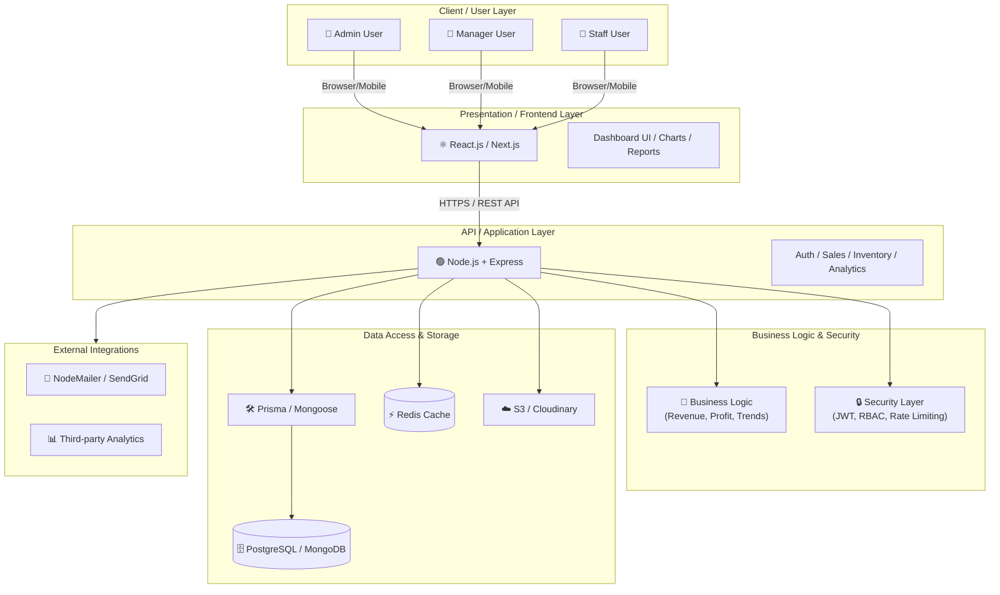
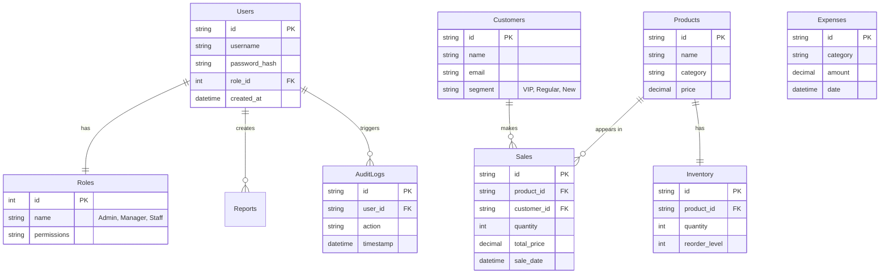
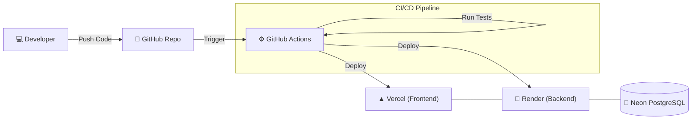

# Smart Business Dashboard Architecture

This document visualizes the system design and architecture of the Smart Business Dashboard, optimized for portfolio presentation and technical reports.

---

## 1. Full System Architecture
A high-level overview of the layered architecture, showing the flow from stakeholders to the core data infrastructure.

---

## 2. Database Schema (ERD)
The recommended relational structure for a professional business dashboard, using PostgreSQL.

---

## 3. DevOps & Deployment Workflow
Automated CI/CD pipeline ensuring code quality and seamless delivery.

---

## 4. Key Strategic Advantages
- **Scalability**: Decoupled frontend/backend allows for independent scaling.
- **Security**: Implemented JWT with Role-Based Access Control (RBAC).
- **Automation**: CI/CD pipeline handles testing and deployment automatically.
- **Data Integrity**: Relational PostgreSQL schema ensures clean business data.
